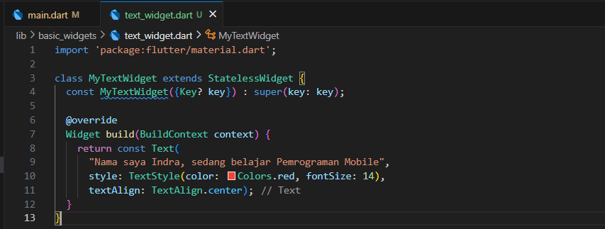
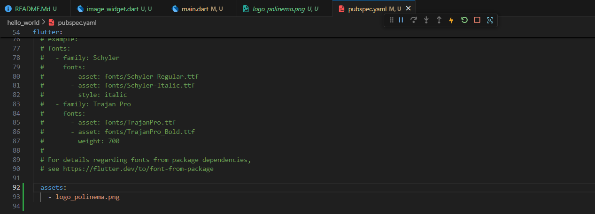
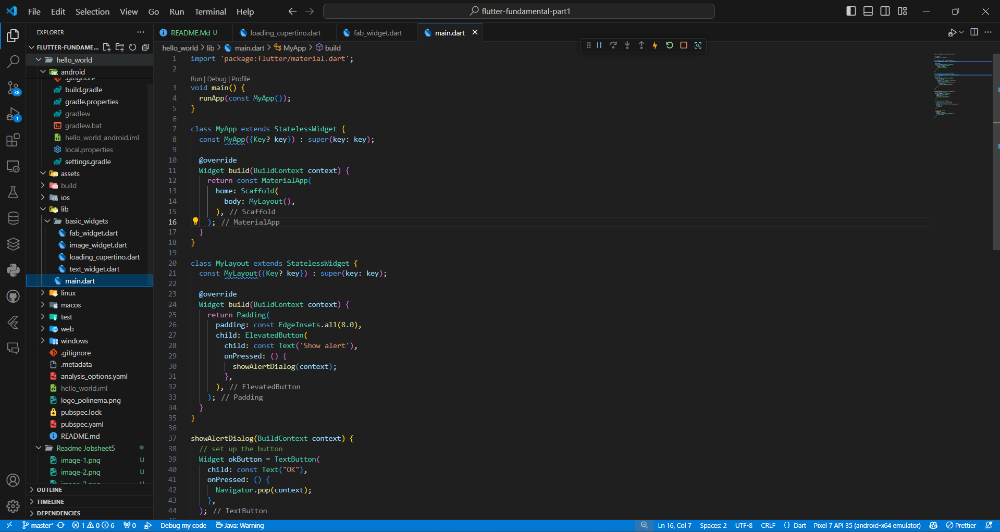
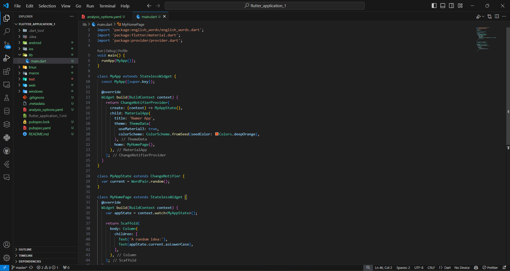
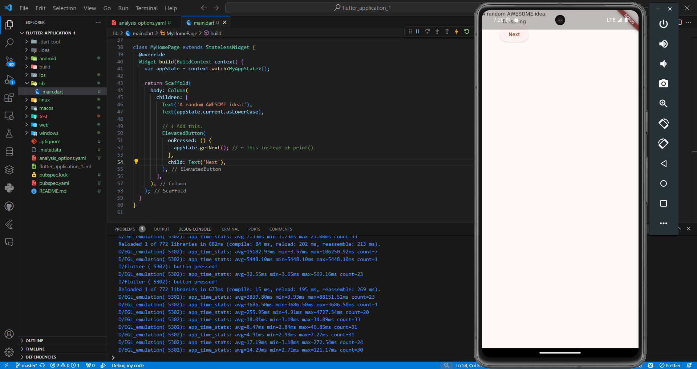
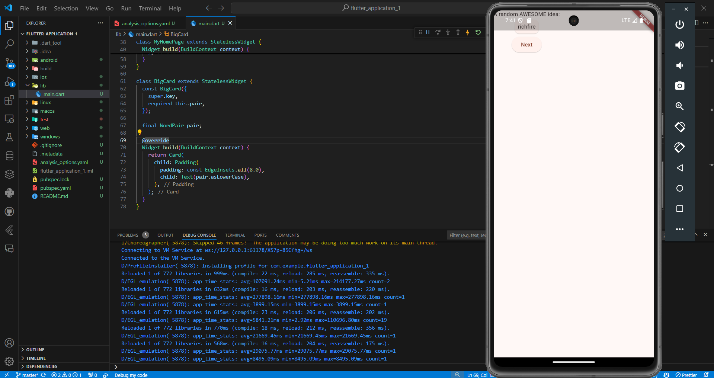
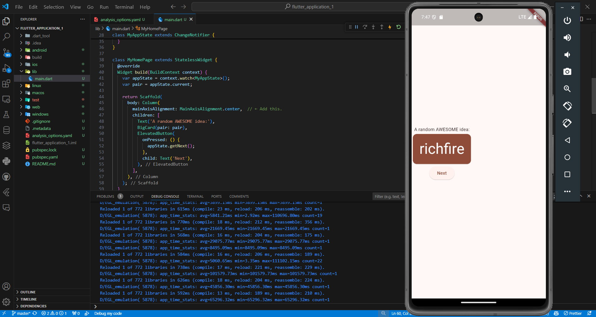

# Jobsheet 05: Aplikasi Pertama dari Widget Flutter Dasar

## Praktikum 1: Membuat Project Flutter Baru

### Langkah 1

### Langkah 2

### Langkah 3

### Langkah 4

### Langkah 5

## Praktikum 2: Menghubungkan Perangkat Android atau Emulator

### Mengaktifkan proses debug USB

### Menjalankan aplikasi di perangkat Android menggunakan kabel

POV Laptop/PC

POV Device Android

### Menjalankan aplikasi di perangkat Android menggunakan Wi-Fi

POV Laptop/PC

POV Device Android

## Praktikum 3: Membuat Repository GitHub dan Laporan Praktikum
### Langkah 1

### Langkah 2

### Langkah 3

### Langkah 4

### Langkah 5

### Langkah 6

### Langkah 7, 8

### Langkah 9

### Langkah 10

## Praktikum 4: Menerapkan Widget Dasar

### Langkah 1

Hasil Akhir

### Langkah 2

Hasil Akhir

## Praktikum 5: Menerapkan Widget Material Design dan iOS Cupertino

### Langkah 1

### Langkah 2

### Langkah 3

Hasil

### Langkah 4

Hasil

### Langkah 5

Hasil

### Langkah 6

Hasil

## Tugas Praktikum

1. Selesaikan Praktikum 1 sampai 5, lalu dokumentasikan dan push ke repository Anda berupa screenshot setiap hasil pekerjaan beserta penjelasannya di file README.md!

2. Selesaikan Praktikum 2 dan Anda wajib menjalankan aplikasi hello_world pada perangkat fisik (device Android/iOS) agar Anda mempunyai pengalaman untuk menghubungkan ke perangkat fisik. Capture hasil aplikasi di perangkat, lalu buatlah laporan praktikum pada file README.md.

3. Pada praktikum 5 mulai dari Langkah 3 sampai 6, buatlah file widget tersendiri di folder basic_widgets, kemudian pada file main.dart cukup melakukan import widget sesuai masing-masing langkah tersebut!

4. Selesaikan Codelabs: Your first Flutter app, lalu buatlah laporan praktikumnya dan push ke repository GitHub Anda!

    1. Membuat Project
    
    
    
    
    
    

        Hasil
    

    2. Menyiapkan Tombol
        Menambahkan tombol
    

        Perilaku pertama anda
    
    

    3. Memperindah tampilan aplikasi
        Mengekstrak widget
        
        Tema dan Gaya
        
        TextTheme
        
        
        Menempatkan UI di tengah
        
        

    4. Menambahkan fungsi
        Menambahkan logika bisnis
        
        Menambahkan tombol
        

    5. Menambahkan kolom samping navigasi
        
        Widget stateless versus stateful
        
        Menggunakan selectedIndex
        
        Tingkat respons
        

    6. Menambahkan halaman baru
        
    

5. README.md berisi: capture hasil akhir tiap praktikum (side-by-side, bisa juga berupa file GIF agar terlihat proses perubahan ketika ada aksi dari pengguna) dengan menampilkan NIM dan Nama Anda sebagai ciri pekerjaan Anda.

6. Kumpulkan berupa link repository/commit GitHub Anda kepada dosen yang telah disepakati!