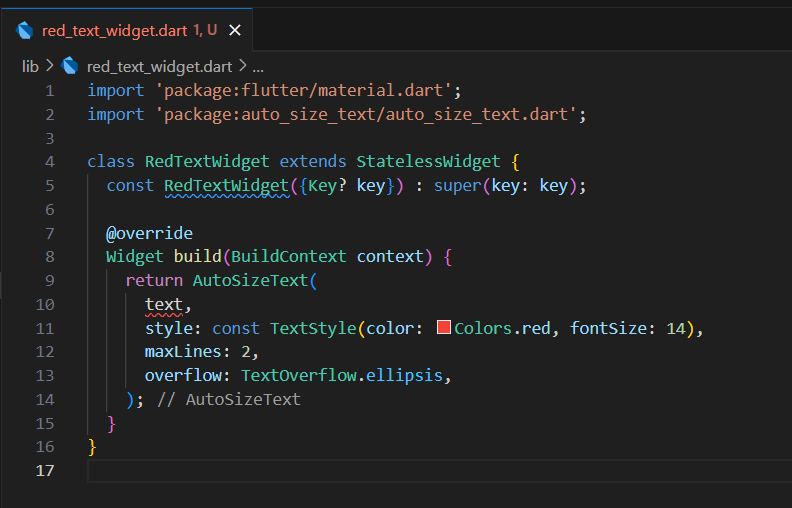

# Jobsheet 07: Manajemen Plugin

## Praktikum Menerapkan Plugin di Project Flutter

### Langkah 1: Buat Project Baru

### Langkah 2: Menambahkan Plugin

### Langkah 3: Buat file red_text_widget.dart

### Langkah 4: Tambah Widget AutoSizeText

### Langkah 5: Buat Variabel text dan parameter di constructor

### Langkah 6: Tambahkan widget di main.dart

### Hasil Run

## Tugas Praktikum
1. Selesaikan Praktikum tersebut, lalu dokumentasikan dan push ke repository Anda berupa screenshot hasil pekerjaan beserta penjelasannya di file README.md!
2. Jelaskan maksud dari langkah 2 pada praktikum tersebut!
3. Jelaskan maksud dari langkah 5 pada praktikum tersebut!
4. Pada langkah 6 terdapat dua widget yang ditambahkan, jelaskan fungsi dan perbedaannya!
5. Jelaskan maksud dari tiap parameter yang ada di dalam plugin auto_size_text berdasarkan tautan pada dokumentasi ini !
6. Kumpulkan laporan praktikum Anda berupa link repository GitHub kepada dosen!