# Jobsheet 07: Kamera

## Praktikum 1: Mengambil Foto dengan Kamera di Flutter

### Langkah 1: Buat Project Baru
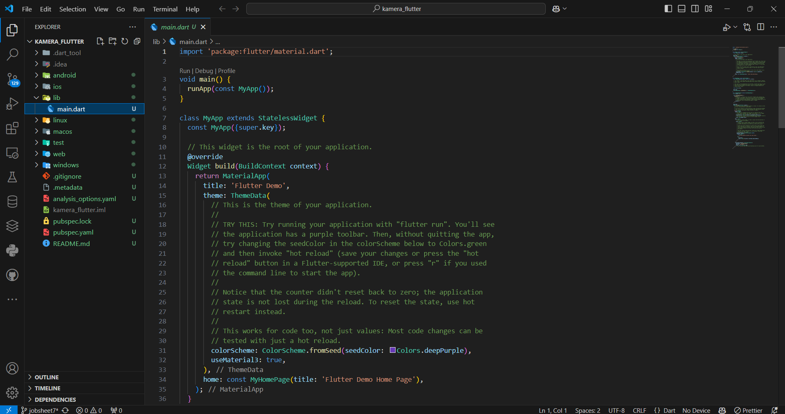
### Langkah 2: Langkah 2: Tambah dependensi yang diperlukan
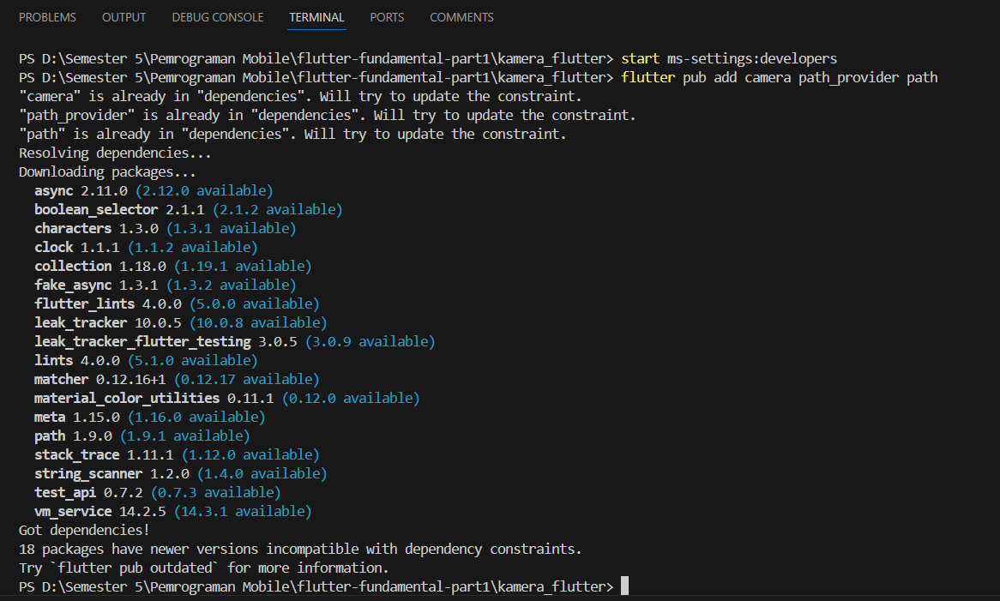
### Langkah 3: Ambil Sensor Kamera dari device
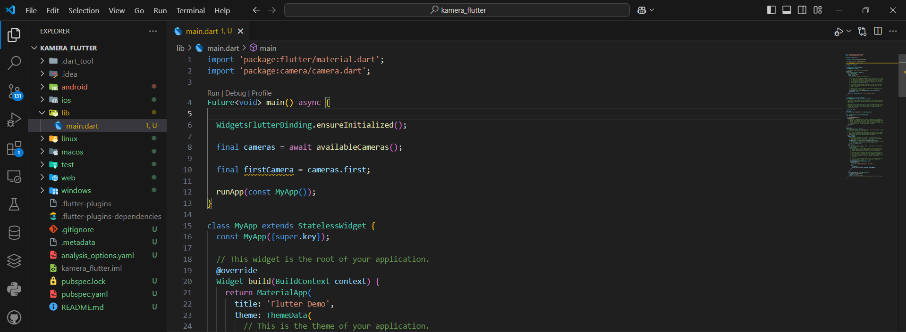
### Langkah 4: Buat dan inisialisasi CameraController
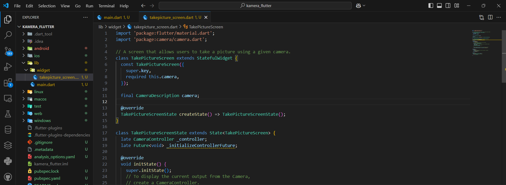
### Langkah 5: Gunakan CameraPreview untuk menampilkan preview foto
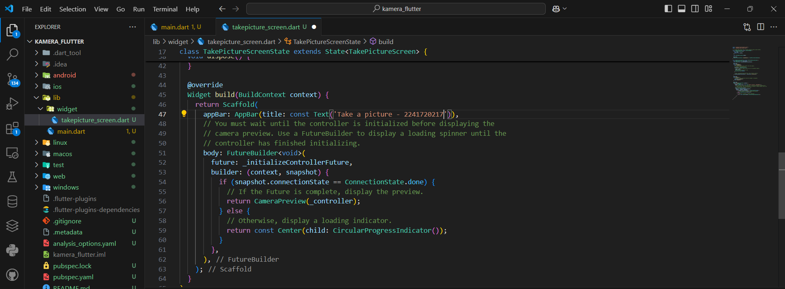
### Langkah 6: Ambil foto dengan CameraController
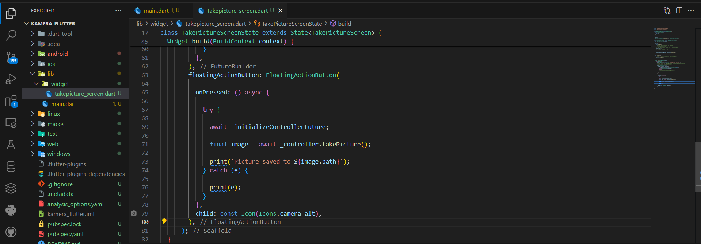
### Langkah 7: Buat widget baru DisplayPictureScreen
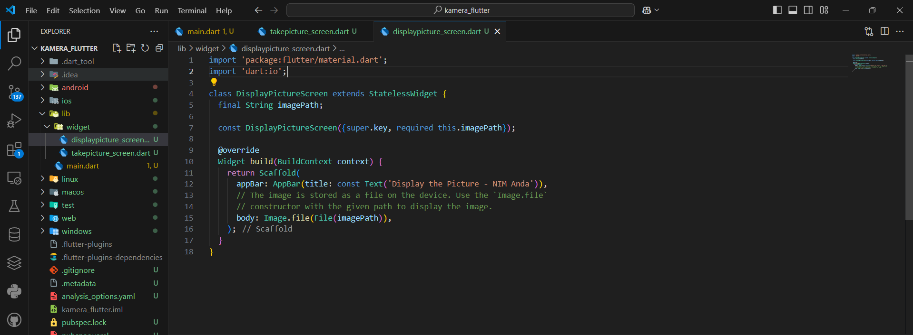
### Langkah 8: Edit main.dart
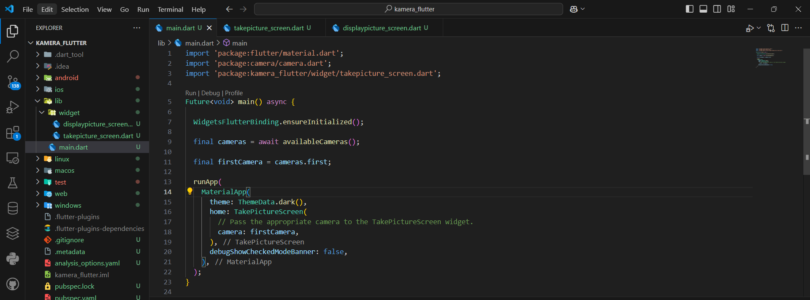
### Langkah 9: Menampilkan hasil foto
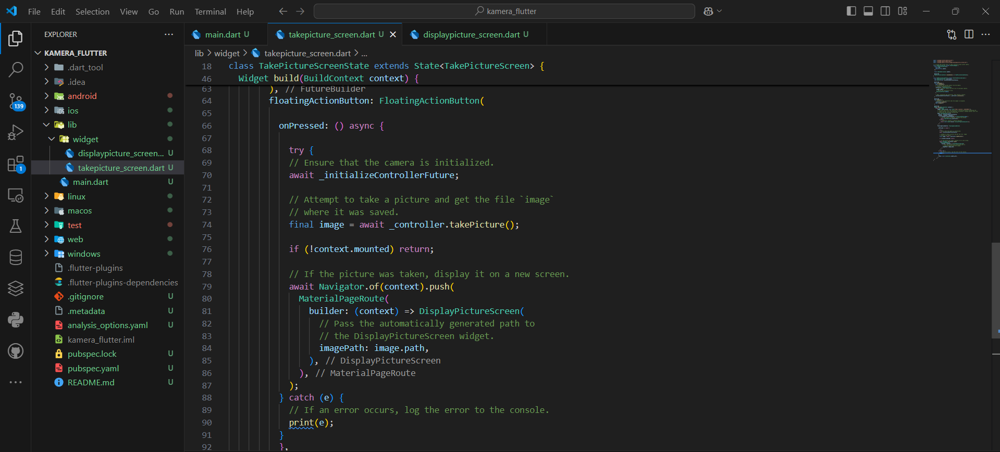

### Hasil Run
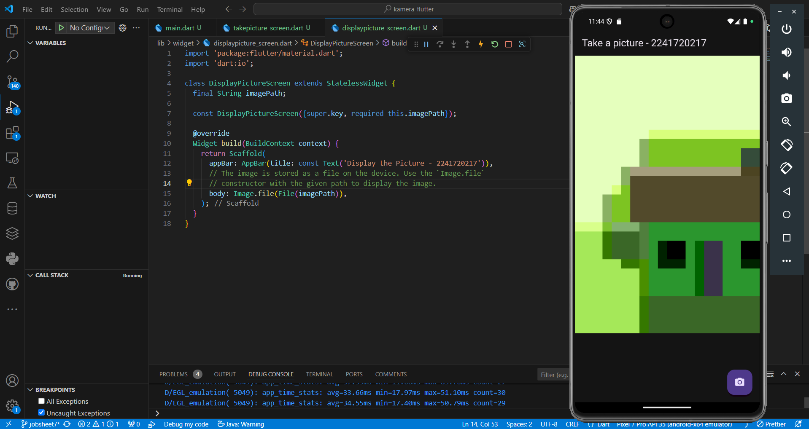
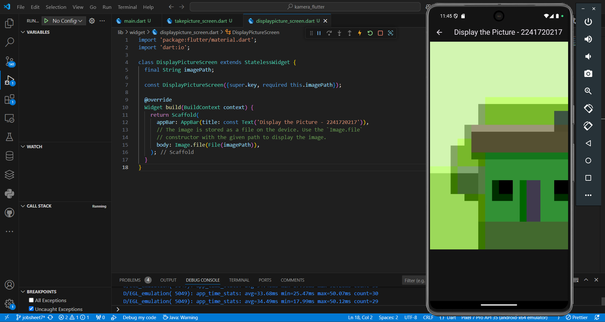

## Praktikum 2: Membuat Photo Filter Carousel

### Langkah 1: Buat project baru

### Langkah 2: Buat widget Selector ring dan dark gradient

### Langkah 3: Buat widget photo filter carousel

### Langkah 4: Membuat filter warna - bagian 1

### Langkah 5: Membuat filter warna

### Langkah 6: Implementasi filter carousel

